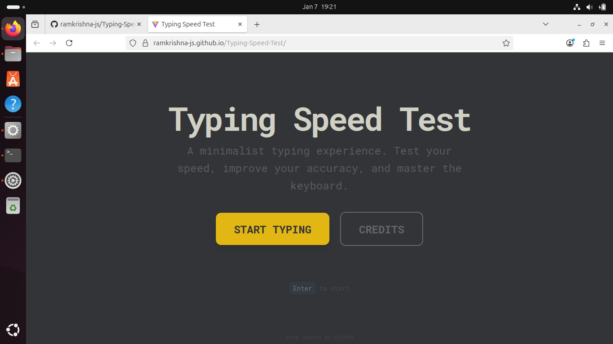

# ⚡ Typing Speed Test

A modern, minimalist typing speed test application built with **React** and **Tailwind CSS**. Measure your Words Per Minute (WPM) and accuracy in a clean, distraction-free environment.

🔗 **[Live Demo](https://ramkrishna-js.github.io/Typing-Speed-Test/)**



## ✨ Features

- **Real-time Metrics**: Instant feedback on WPM, accuracy %, and time remaining.
- **Dynamic Highlighting**: Visual cues for correct (green) and incorrect (red) characters as you type.
- **Responsive Design**: Looks great on desktops, tablets, and mobile devices.
- **Dark Mode UI**: Easy on the eyes with a slate-gray and yellow color scheme.
- **Restart Capability**: Quickly reset the test to try again.

## 🛠️ Tech Stack

- **[React](https://react.dev/)**: For building the interactive user interface.
- **[Vite](https://vitejs.dev/)**: For lightning-fast development and building.
- **[Tailwind CSS](https://tailwindcss.com/)**: For utility-first, modern styling (v4).
- **[GitHub Pages](https://pages.github.com/)**: For seamless deployment.

## 🚀 Getting Started

Follow these steps to run the project locally on your machine.

### Prerequisites

- Node.js (v18 or higher)
- npm (usually comes with Node.js)

### Installation

1.  **Clone the repository**
    ```bash
    git clone https://github.com/ramkrishna-js/Typing-Speed-Test.git
    cd Typing-Speed-Test
    ```

2.  **Install dependencies**
    ```bash
    npm install
    ```

3.  **Start the development server**
    ```bash
    npm run dev
    ```
    Open [http://localhost:5173](http://localhost:5173) in your browser.

## 📦 Building for Production

To create a production-ready build:

```bash
npm run build
```

The output will be in the `dist` directory.

## 🚢 Deployment

This project is configured for deployment to GitHub Pages.

```bash
npm run deploy
```

## 🤝 Contributing

Contributions are welcome! Feel free to open an issue or submit a pull request if you have ideas for improvements.

## 📄 License


This project is licensed under the [MIT License](LICENSE).


## 🤝 Acknowledgments


- **Lead Developer**: [ramkrishna-js](https://github.com/ramkrishna-js)


- **Co-Author**: [manjunathh-xyz](mailto:ugadim51@gmail.com)


---


Built with ❤️ by [ramkrishna-js](https://github.com/ramkrishna-js) and contributors.
